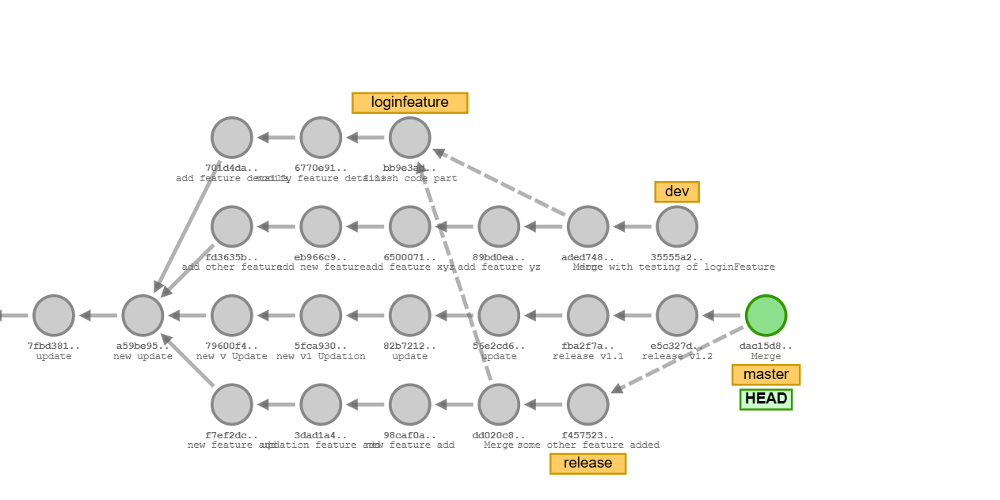

# Git_Training_Aman_Sir


# Git Branching Task

## 📸 Screenshot of the Task



---

## Explanation

### 1. Initial Commits in the `master` Branch

```bash
git commit -m "update"
git commit -m "new update"
```

### 2. Create three branches named `dev, release, loginfeature`

```bash
git checkout -b dev
git checkout -b release
git checkout -b loginfeature

```

### 3. checkout `master`(prod) branch and add some commits

```bash
git checkout master
git commit -m "new v Update"
git commit -m "new v1 Updation"
```

### 4.checkout `dev` branch and add some commits

```bash
git checkout dev
git commit -m "add other feature"
git commit -m "add new feature"

```

### 5. checkout `release` branch and add some commits

```bash
git checkout release
git commit -m "new feature add"
git commit -m "updation feature add"
git commit -m "new feature add"
```

### 6. checkout `loginfeature` branch and add some commits.

```bash
git checkout loginfeature
git commit -m "add feature details"
git commit -m "modify feature details"
git commit -m "finish code part"
```
### 7. checkout `dev` branch and merge `loginfeature` branch into `dev`

```bash
git checkout dev
git commit -m "add feature xyz"
git commit -m "add feature yz"
git merge loginfeature -m "add loginfeature"
```

### 8. checkout `release` branch and merge `feature` to release after succesfully dev tested.

```bash
git checkout release
git merge loginfeature -m "add login feature"
git commit -m "some other feature added"
```

### 9. With new version release add `release` brach to master(Merge). 

```bash
git checkout master
git commit -m "release v1.1"
git commit -m "release v1.2"
git merge release -m "release v1.3"
```
